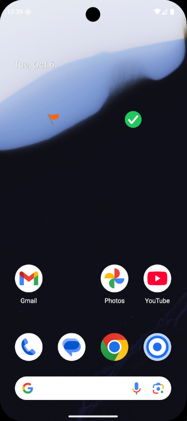
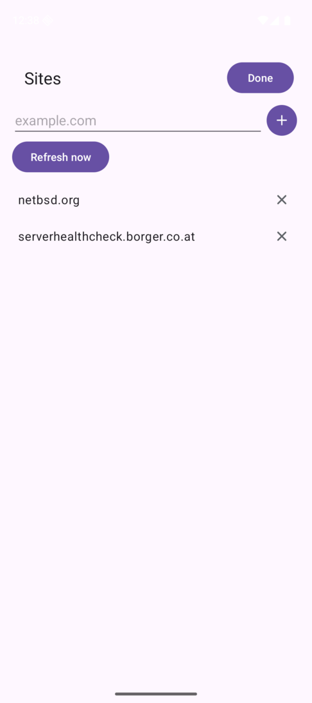

# ShowFavicon (Android)

A home screen widget that keeps one favicon per monitored website. Tap an icon
and the site opens in the browser. The icons are refreshed once an hour and
whenever the device changes networks; a site whose last fetch failed keeps its icon
but shows it grayed out.

<p>


</p>

Left: the widget on the home screen — the green check mark is an SVG favicon, the
flag came out of an ICO file. Right: the settings screen that maintains the list.
Both are in [`screenshots/`](screenshots).

## Status

Milestones 1 to 4 of [`doc/plan-android.md`](doc/plan-android.md) are
implemented: widget, settings screen (add, edit, remove), fetch and cache, grayed
icons, a multi-site list of up to four entries, and icon decoding for raster
formats, SVG and ICO. The project **builds**: `assembleDebug` and `lintDebug` are
green with Android Gradle Plugin 9.4.1, Gradle 9.8.0 and JDK 21, compiling against
API 37.2 — and lint reports no findings.

Known gaps against the plan:

- Only the first four sites get a widget slot (`MAX_SLOTS` in
  `FaviconWidgetProvider`), because `RemoteViews` cannot add views at runtime.
- Per widget instance configuration (`android:configure`) is **dropped by
  decision**: the widget always shows the first four sites, and the settings list is
  the only place to edit them.
- No notification / foreground service; the widget is the only surface.
- No launcher icon artwork yet, only a placeholder ring.
- No signed release build (AAB) yet.

A tray version for Windows 11 is planned separately in
[`doc/plan-windows-11.md`](doc/plan-windows-11.md); it was written before this port
and now carries a section with everything that transferred.

## Requirements

- JDK 21 (AGP 9.4 rejects newer JDKs in this setup); the build is started with an
  explicit `JAVA_HOME`
- Android SDK with platform **37.2**, build-tools 36.0.0 and platform-tools
- `adb`, and a device or an emulator (needs `/dev/kvm`)

[`scripts/install-android-toolchain.sh`](scripts/install-android-toolchain.sh)
installs all of that on CachyOS / Arch, idempotently. `--dry-run` prints the
steps without touching the system.

## Build

```fish
env JAVA_HOME=/usr/lib/jvm/java-21-openjdk ./gradlew assembleDebug   # APK in app/build/outputs/apk/debug/
env JAVA_HOME=/usr/lib/jvm/java-21-openjdk ./gradlew lintDebug
env JAVA_HOME=/usr/lib/jvm/java-21-openjdk ./gradlew installDebug    # onto the connected device
```

`JAVA_HOME` is passed explicitly because this machine also carries JDK 25, which
AGP 9.4 does not support. The SDK location comes from `local.properties`
(`sdk.dir=…`, not versioned) or from `ANDROID_HOME`.

The everyday steps around that are wrapped twice: `scripts/install-on-device.sh`
builds and installs on the attached phone (`--launch` starts the app afterwards),
`scripts/emulator-run.sh` creates or boots the AVD, installs and launches (`--stop`
shuts it down). In VS Code the same steps are the tasks **Android: install on
device**, **Android: run on emulator** and **Android: stop emulator**, next to the
build task above.

Everything that went wrong on the way to a green build is written down in
[`.github/skills/android-build/SKILL.md`](.github/skills/android-build/SKILL.md).

## How it works

| Piece | Responsibility |
| --- | --- |
| `MainActivity` | Settings screen: the list of sites, add, edit (tap a row) and remove, and **Done** in the toolbar to close it |
| `SiteStore` | The site list, in `SharedPreferences` as one newline separated value |
| `FaviconWorker` | Hourly `WorkManager` job, plus one on every network change and on demand: fetch, cache, redraw the widget. A run that leaves a site failing asks for a retry. |
| `FaviconFetcher` | Two small `HttpURLConnection` GETs — the page, then the icon — following redirects even across protocols |
| `FaviconResolver` | Finds `<link rel="…icon…">` candidates, ranks raster above vector, and falls back to `/favicon.ico` at the origin |
| `SvgRasterizer` / `IcoDecoder` | The two formats `BitmapFactory` cannot read: SVG is rendered, ICO is unpacked including palette, alpha and AND mask |
| `FaviconStore` | `filesDir/showfavicon/<host>.png`, atomic writes, failed-fetch flag, graying |
| `FaviconWidgetProvider` | Draws one slot per site, tap opens the site |
| `ShowFaviconApp` | Registers the network callback that spots a change of network |

The cache is the only state: if a fetch fails, the previous PNG stays in place
and is drawn desaturated through a `ColorMatrix`.

## Vibecoded

Written by **DeepSeek V4 Flash** in Visual Studio Code **1.140.0** through the extension `vizards.deepseek-v4-for-copilot` **0.9.3** — build tooling: Android Gradle Plugin 9.4.1 with built-in Kotlin, Gradle 9.8.0, compileSdk 37.2, targetSdk 37, minSdk 26.

## License

MIT, see [`LICENSE`](LICENSE).
